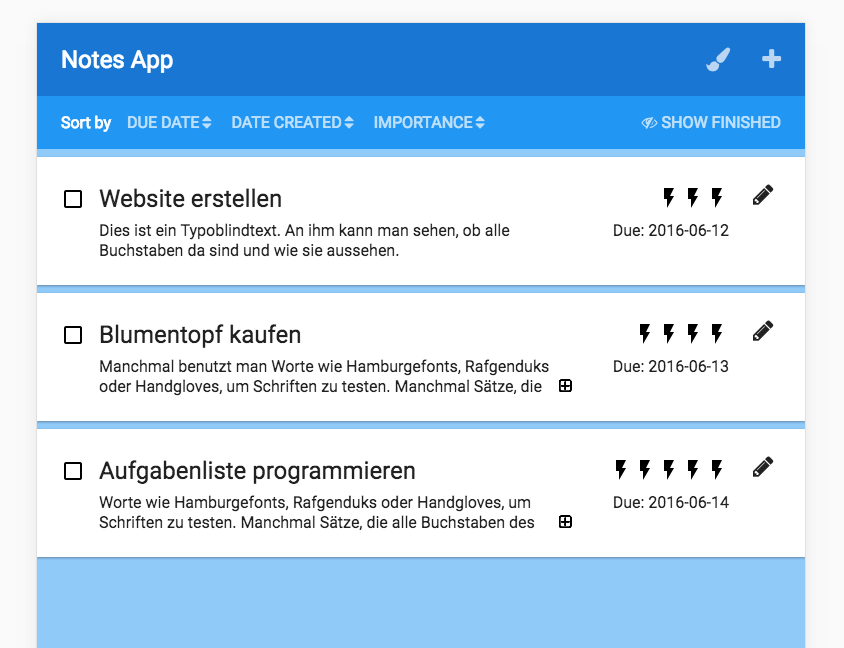

# NotesApp
HSR CAS Front End Engineering 2016 
Project assignment 1 
Team 9, Isa Steiner, Patrick Bonetti  

## Installation

_Prerequisite: [Node.js](https://nodejs.org) must be installed._

Just check out the git repo and run `npm install` in the root directory of the app.

Details:
* git clone git@github.com:pxmch/cas-fee-notesapp.git
* cd cas-fee-notesapp
* npm install

## Starting the app

Starting the server:
Run `npm start` within the directory of the app. The server will listen on http://localhost:3001.

Starting the app:
To start the client, open http://localhost:3001/index.html in a web browser

## Remarks
* This app has only been tested on the latest versions of Chrome, Safari and Firefox on Mac
* Both themes of the client are responsive and work on different screen sizes
* The note edit mask has no mandatory fields on purpose - i.e. a note does not need a priority or a due date.

## Development
Running `gulp build` generates a `/dist` folder with the frontend client. This is the directory from where the server serves the client.
For development purposes you can use `gulp serve:watch`. This command opens the client with browsersync on http://localhost:9000, refreshing the client automatically when assets change. 

## Credits
This app is written in Javascript (client and server) and uses [Node.js](https://nodejs.org/) with
[Express](http://expressjs.com) on the server-side. 

Other used components in alphabetical order:
- [Bower](https://bower.io)
- [Font Awesome](http://fontawesome.io)
- [Gulp](http://gulpjs.com) 
- [Handlebars](http://handlebarsjs.com)
- [jQuery](https://jquery.com)
- [Moment.js](http://momentjs.com/)
- [Normalize.css](https://necolas.github.io/normalize.css/)

The initial setup of this app is based on a boilerplate generated with [Yeoman Web App Generator](https://github.com/yeoman/generator-webapp#readme)
